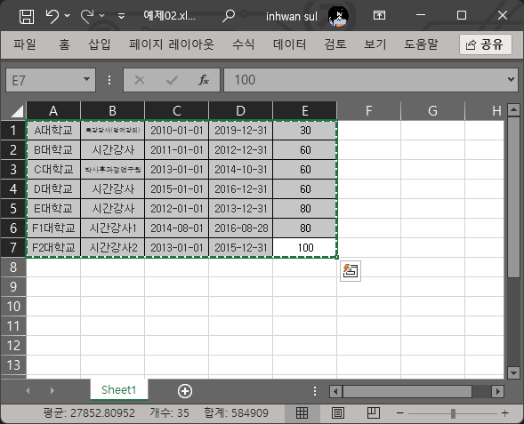

#교원 채용 경력 계산기

구글 코랩에서 바로 실행할 수 있습니다.
[코랩바로가기](https://colab.research.google.com/drive/1WDVoKEq0pXfL5odknjRKa0s0P_cbsPHB)

(엑셀 파일은 다음형식으로 준비합니다)

p.s. PC버전 (kit_career(PC).ipynb)은 엑셀 영역을 ctrl-c한 뒤 셀을 실행하면 됩니다.
